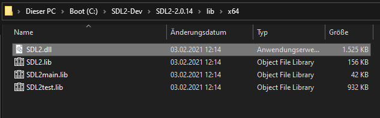
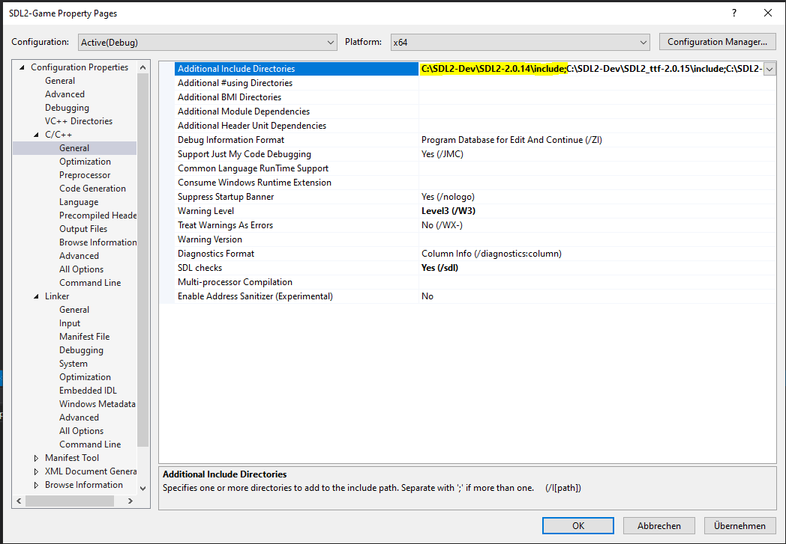
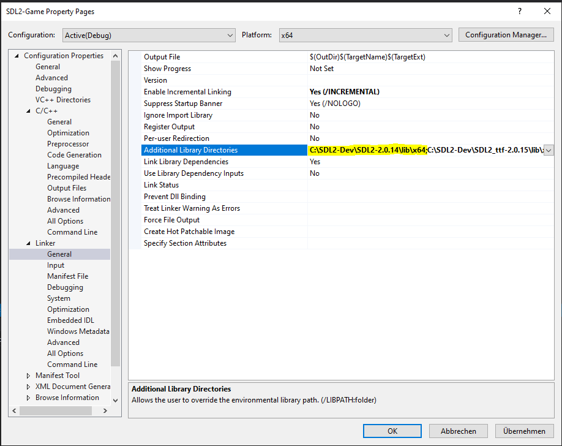
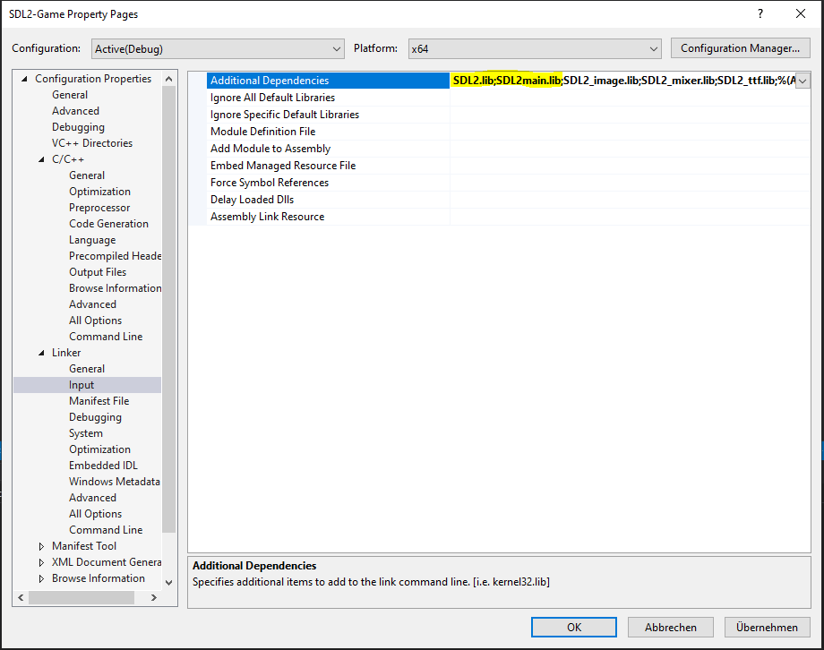

# Windows Installation

Die C++ Bibliothek [SDL2](https://www.libsdl.org/download-2.0.php) herunterladen und an einem beliebigen Ort entpacken.

Ein Visual Studio Projekt erstellen.

DLL Dateien aus dem SDL2 Ordner in das Projektverzeichnis kopieren.

Include-Pfad von SDL2 hinzufügen. Properties -> C/C++ -> Additional Include Directories 

Bibliothek-Pfad von SDL2 einbinden. Properties -> Linker -> General -> Additional Library Directories

Bibliothek-Dateien von SDL2 angeben. Properties -> Linker -> Input -> Additional Dependencies

