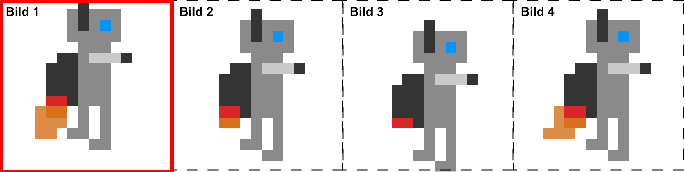
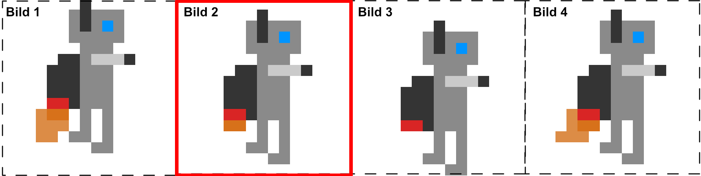
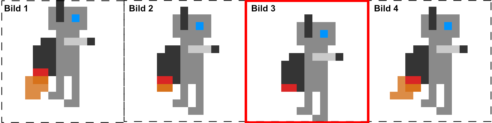
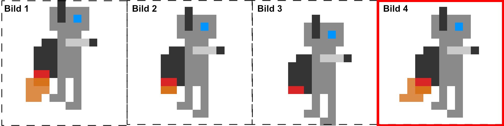

# Sprite rendern und animieren

Ein Sprite beschreibt hier eine grafische Entität, die ein Objekt oder ein Wesen darstellen soll.  


Die dargestellte Abbildung stellt beispielhaft einen Sprite dar.

Wie würde man in der Theorie einen Sprite animieren?
Ein animierter Sprite besteht aus vielen Einzelbildern die nacheinander angezeigt werden.






Die Abbildung zeigt wie solch eine Iteration durch verschiedene Bilder aussehen kann. 
Meistens befindet sich die Bildsequenz in einer Bilddatei und ist nicht auf verschiedene Dateien aufgeteilt.
Das Aufteilen der Einzelbilder muss dann im Programm durchgeführt werden.

```cpp
//Sprite.h
class Sprite :
	public Gameobject
{
public:
	Sprite(std::string file, int frames, SDL_Rect position, int speed, Game* instance);
	~Sprite();
	
	std::vector<SDL_Rect*> spriteClips;
	SDL_Texture* sourceTexture;
	int active_clip = 0;
	int speed;
	int frames;
	bool visible = true;
	int time = 0;
	SDL_RendererFlip flip = SDL_FLIP_NONE;
	
	void update(int delta);
	void render();
	SDL_Rect* getActiveClip();
	void setSize(int width, int height);
	void setPosition(int x, int y);
	void setVisible(bool visible);
	void setHorizontalFlip(bool flip);
};
```
Da die Klasse Sprite eine Entität in dem Spiel darstellt, erbt diese auch von der Klasse Gameobject.
Das wichtigste ist, dass die Klasse eine Textur besitzt, hier sourceTexture genannt. 
Dann gibt es noch die Liste spriteClips, die für jedes Einzelbild in der Textur einen passenden Rahmen gespeichert hat.
Mit der Varibale active_clip wird festgehalten, welcher Rahmen derzeit zum rendern genutzt werden soll. Mit der Variable speed ist es möglich
die Geschwindigkeit der Animation zu bestimmen. Die Variable frames speichert, wie viele Einzelbilder in der Textur existieren.
Mit der Variable visible kann man bestimmen, ob das Sprite gerendert werden soll oder nicht. 
Mit der Variable flip kann bestimmt werden, ob das Sprite gespiegelt gerendert werden soll.
Für alle flip Flags kann [hier](https://wiki.libsdl.org/SDL_RendererFlip) nachgeschaut werden.

```cpp
//Sprite.cpp
Sprite::Sprite(std::string file, int frames, SDL_Rect position,int speed, Game* instance) : Gameobject(instance)
{
	sourceTexture = TextureLoader::loadTextureFromImage(file,instance->renderer);
	this->frames = frames;
	this->speed = speed;
	for (int i = 0; i < frames; i++)
	{
		SDL_Rect* spriteFrame = new SDL_Rect;
		spriteFrame->x = i * position.w;
		spriteFrame->y = 0;
		spriteFrame->w = position.w;
		spriteFrame->h = position.h;
		spriteClips.push_back(spriteFrame);
	}
	this->position = position;
	type = "Sprite";
}
```
Im Konstruktor von der Klasse Sprite wird zuallerst die Textur geladen. 
Anschließend werden Informationen wie die Anzahl der Einzelbilder und die gewünschte Animationsgeschwindigkeit gespeichert.
In der Folgenden for-Schleife werden die Rahmen berechnet und gespeichert. Dies erfolgt über SDL_Rect-Objekte. 
Ein SDL_Rect-Objekt hat die Attribute x,y,w und h. Es ist also mit einem SDL_Rect-Objekt möglich ein positioniertes Rechteck zu definieren.
In diesem Fall wird für jedes Einzelbild ein SDL_Rect erstellt und in die Liste spriteClips gespeichert. Die Breite und Höhe für jedes Einzebild ist in dem Parameter position gespeichert und kann somit
auch für jeden Rahmen verwendet werden. Die Position der Rahmen sind abhängig von der Breite jedes Einzelbildes multipliziert mit dem Index des aktuellen Bildes. 
Diese Art der Segementierung funktioniert allerdings nur für Spritesheets die 1-dimensional sind.
Zuletzt wird noch der Parameter position in die Variable position gespeichert. Die Variable position wird bestimmen, wo und wie groß das Sprite gerendert wird.

```cpp
//Sprite.cpp
void Sprite::update(int delta)
{
	time += delta;
	if (time > speed)
	{
		active_clip++;
		time = time - speed;
	}
	if (active_clip >= frames)
	{
		active_clip = 0;
	}
}
```
In der Funktion update wird dann das Wechseln der Rahmen durchgeführt. Auf die Variable time wird die Delta-Zeit addiert und wenn dann time größer als die Variable speed ist, wird der nächste Rahmen geladen.
Die letzte If-Bedingung sorgt dafür, dass nach dem letzten Rahmen wieder der Erste genommen wird. In diesem Fall sorgen kleinere Werte bei speed für eine höhere Animationsgeschwindigkeit, da speed effektiv die Pause zwischen dem 
Weiterschalten der Einzelbilder darstellt.

```cpp
//Sprite.cpp
void Sprite::render()
{
	if (visible)
	{
		SDL_RenderCopyEx(instance->renderer,sourceTexture,spriteClips[active_clip], &position, NULL, NULL, flip);
	}
}
```
In der Funktion render wird mithilfe der Funktion SDL_RenderCopyEx der Sprite in den Render-Buffer geladen. Der erste Parameter ist der Renderer des Spiels.
Der zweite Parameter ist die Textur die genutzt wird. Der dritte Parameter ist der Rahmen für die Textur und grenzt somit den Bereich ein der gerendert werden soll.
Der vierte Parameter bestimmt die Position und Größe des Sprites. Mit dem fünften Parameter wäre es möglich den Sprite um eine bestimmte Gradzahl zu rotieren.
Der sechste Parameter würde für diese Rotation den Mittelpunkt bestimmen. Mit dem siebten und letzten Parameter lässt sich das Sprite gespiegelt rendern.
 
```cpp
//Sprite.cpp
 Sprite::Sprite(std::string file, int frames, SDL_Rect position,int speed, Game* instance) : Gameobject(instance)
{
	sourceTexture = TextureLoader::loadTextureFromImage(file,instance->renderer);
	this->frames = frames;
	this->speed = speed;
	for (int i = 0; i < frames; i++)
	{
		SDL_Rect* spriteFrame = new SDL_Rect;
		spriteFrame->x = i * position.w;
		spriteFrame->y = 0;
		spriteFrame->w = position.w;
		spriteFrame->h = position.h;
		spriteClips.push_back(spriteFrame);
	}
	this->position = position;
	type = "Sprite";
}
Sprite::~Sprite()
{
	instance->unregisterGameobject(this);
	for (int i = 0; i < spriteClips.size(); i++)
	{
		delete spriteClips[i];
	}
	SDL_DestroyTexture(sourceTexture);
}
SDL_Rect* Sprite::getActiveClip()
{
	return spriteClips[active_clip];
}
void Sprite::update(int delta)
{
	time += delta;
	if (time > speed)
	{
		active_clip++;
		time = time - speed;
	}
	if (active_clip >= frames)
	{
		active_clip = 0;
	}
}
void Sprite::setSize(int width, int height)
{
	position.w = width;
	position.h = height;
}

void Sprite::setPosition(int x, int y)
{
	position.x = x;
	position.y = y;
}

void Sprite::render()
{
	if (visible)
	{
		SDL_RenderCopyEx(instance->renderer,sourceTexture,getActiveClip(), &position, NULL, NULL, flip);
	}
}

void Sprite::setVisible(bool visible)
{
	this->visible = visible;
}

void Sprite::setHorizontalFlip(bool flip)
{
	if (flip)
	{
		this->flip = SDL_FLIP_HORIZONTAL;
	}
	else
	{
		this->flip = SDL_FLIP_NONE;
	}
}
```
Hier nochmal die gesamte Implementation.

## Dokumentation zu den hier verwendeten SDL2 Funktionen

[SDL_RenderCopyEx](https://wiki.libsdl.org/SDL_RenderCopyEx)

[SDL_Rect](https://wiki.libsdl.org/SDL_Rect)

